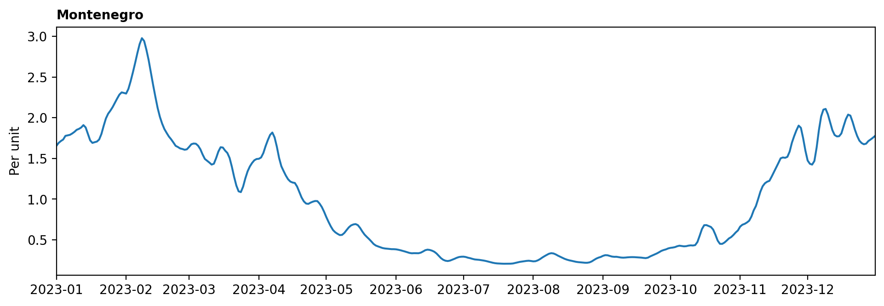
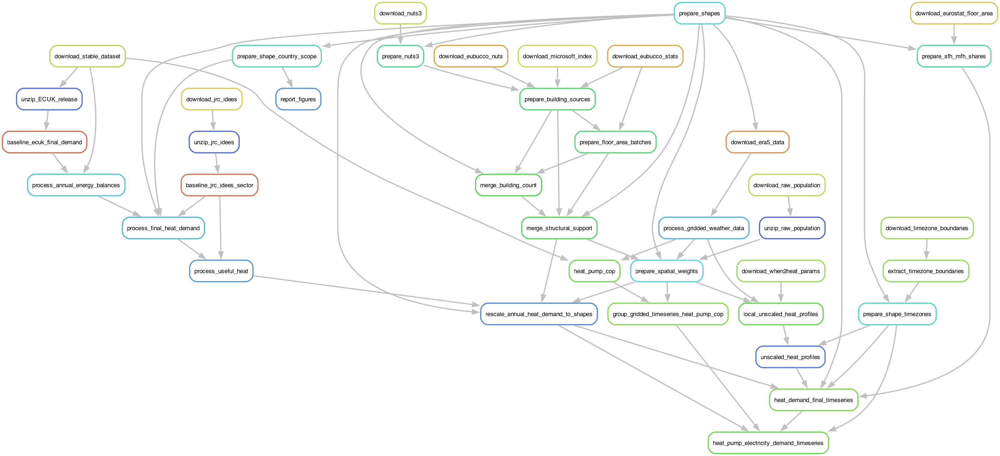
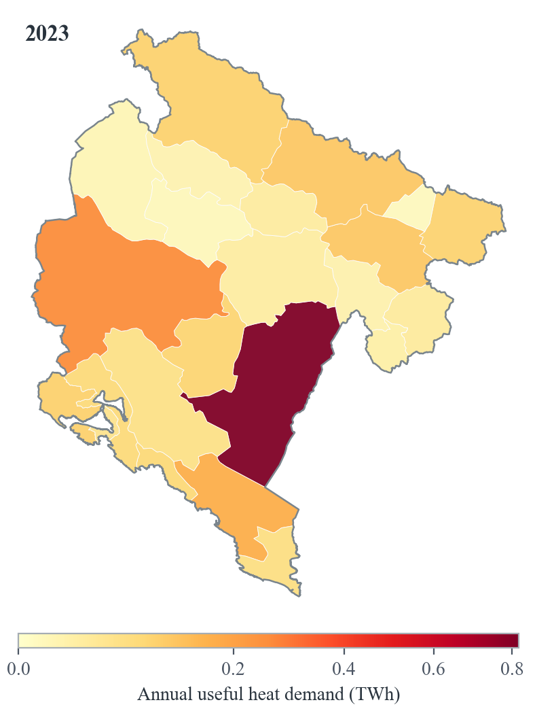

# European Building Heat

This module prepares time series of heat demand and heat supply technologies for buildings in European countries.

<!-- Example module output -->
<p align="center">
  
  <br>
  <em>Example 2023 daily heat-demand profile (seven-day rolling mean).</em>
</p>


## About
<!-- Please do not modify this templated section -->

This is a modular `snakemake` workflow created as part of the [Modelblocks project](https://www.modelblocks.org/). It can be imported directly into any `snakemake` workflow.

For more information, please consult the Modelblocks [documentation](https://modelblocks.readthedocs.io/en/latest/),
the [integration example](./tests/integration/Snakefile),
and the `snakemake` [documentation](https://snakemake.readthedocs.io/en/stable/snakefiles/modularization.html).

## Overview
<!-- Please describe the processing stages of this module here -->

This module combines national annual heat-demand statistics with weather-driven
hourly profiles and scales them to user-provided European regions using
population weights.

Data processing steps:

<p align="center">
  
</p>

1. Prepare the spatial scope from the user-provided shapes file. The module
   keeps land shapes, validates their identifiers and geometries, and determines
   the native and proxy countries needed for the requested `{shapes}` case.
2. Download the required automatic inputs, including ERA5 weather, GHSL
   population, When2Heat parameters, Eurostat and Swiss statistics, ECUK,
   JRC-IDEES, heat-pump characteristics, and the pinned IANA timezone
   boundaries.
3. Process national annual final heat demand. Household demand is derived from
   Eurostat, Swiss, and ECUK end-use statistics; commercial demand is estimated
   using energy balances and JRC-IDEES tertiary-sector end-use data.
4. Use published JRC-IDEES useful heat demand where available, or convert final
   energy demand with the configured technology efficiencies for space heat,
   hot water, and cooking.
5. Calculate population weights on the ERA5 weather grid, allocate national
   annual useful heat demand to the requested shapes, and create the annual
   demand choropleth.

<p align="center">
  
</p>

6. Calculate country-specific single-family and multi-family dwelling shares
   from the 2021 Eurostat census, using configured reference countries where
   data are missing.
7. Infer exactly one IANA timezone for every shape from its geometric centroid,
   independently of the `country_id` used for annual statistics.
8. Process ERA5 air temperature, wind speed, and soil temperature, then
   generate commercial, single-family, and multi-family heat-demand profiles
   with the When2Heat method and local civil-clock factors.
9. Aggregate the gridded demand profiles to the requested shapes using the same
   population weights and cache one compact local-clock file per weather year.
10. Align each local profile to a continuous UTC timeline using its inferred
    timezone, combine the building types, pair weather years with model years,
    scale to annual useful demand, and write the hourly demand and its plot.
11. Calculate air-source and ground-source heat-pump COP from ERA5 air and soil
    temperatures, configured sink temperatures, and technology shares. Aggregate
    the COP to shapes and weight space heat and hot water using annual demand.
12. Divide hourly heat demand by COP to obtain heat-pump electricity demand,
    then write both hourly datasets with the same UTC timeline and timezone
    provenance metadata.

### Timezone handling

Timezone assignment is geometry-based and independent of `country_id`, which
is used only to match shapes to national heat statistics. The workflow computes
each shape centroid in the configured projected CRS, transforms the centroid to
EPSG:4326, and intersects it with the pinned, land-only timezone-boundary dataset.

Each centroid must intersect exactly one valid IANA timezone. Assignment fails
with the affected shape IDs and centroid coordinates if no timezone or multiple
timezones match. There is no country-code, representative-point, ocean-zone,
or nearest-zone fallback.

When2Heat hourly factors are interpreted in local civil time and selected onto
a canonical UTC hourly index. The spring daylight-saving gap is skipped and
the repeated autumn hour is selected twice. ERA5 analysis timestamps remain UTC.

## Configuration
<!-- Please describe how to configure this module below -->

Please consult the configuration [README](./config/README.md) and
[example](./config/config.yaml) for all configuration options.

Earth Data Hub access requires an account and an API key from the
[account settings](https://earthdatahub.destine.eu/account-settings#my-personal-access-tokens).
Save the key by itself in `resources/user/edh_api.txt`; the file is ignored by
Git.

## Input / output structure
<!-- Please describe input / output file placement below -->

Please consult the [interface file](./INTERFACE.yaml) for the machine-readable
module interface and the [integration example](./tests/integration/Snakefile)
for a complete module import.

The module receives inputs and exposes results through Snakemake path variables:

| Path variable | Default path | Description |
| --- | --- | --- |
| `edh_api` | `<resources>/user/edh_api.txt` | Earth Data Hub API key used to download ERA5 data. |
| `shapes` | `<resources>/user/{shapes}/shapes.parquet` | User-provided polygons to process. |
| `annual_heat_demand` | `<results>/{shapes}/annual/annual_heat_demand.parquet` | Tidy annual useful heat demand in TWh with `end_use`, `category`, `year`, `shape_id`, and `annual_heat_demand_twh` columns. |
| `heat_demand` | `<results>/{shapes}/hourly/hourly_heat_demand.parquet` | Final hourly useful heat demand by shape. |
| `heat_pump_cop` | `<results>/{shapes}/hourly/heat_pump_cop.parquet` | Final hourly heat-pump COP by shape. |
| `heat_pump_electricity_demand` | `<results>/{shapes}/hourly/heat_pump_electricity_demand.parquet` | Final hourly electricity demand for heat pumps by shape. |
| `annual_heat_demand_choropleth` | `<results>/{shapes}/visualization/annual_heat_demand.pdf` | Static annual useful heat-demand map by shape. |
| `heat_demand_timeseries` | `<results>/{shapes}/visualization/heat_demand_timeseries.pdf` | Static heat-demand profile with one subplot per shape. |

The shapes input must be a GeoParquet file containing:

- `shape_id`: unique identifier for each output region.
- `country_id`: ISO 3166-1 alpha-3 country code used to match national heat
  statistics and configured proxies.
- `shape_class`: shape context. Only rows with the exact value `land` are
  processed.
- `geometry`: polygon geometry with correct CRS metadata readable by GeoPandas.
  The workflow normalises prepared shapes to EPSG:4326 internally.

The annual-demand output is a wide Parquet table with a `year`, `end_use`, and
`cat_name` index and shape IDs as columns. Values are annual useful heat demand
in TWh.

The final `heat_demand`, `heat_pump_cop`, and
`heat_pump_electricity_demand` outputs are wide Parquet tables with shape IDs as
columns and a timezone-aware `datetime64[ns, UTC]` index named `timesteps`.
Every timestamp identifies the start of its UTC hourly period. Their Parquet
schema metadata records `output_timezone: UTC` and the JSON
shape-to-IANA-timezone mapping under `shape_timezones`.

## Development
<!-- Please do not modify this templated section -->

We use [`pixi`](https://pixi.sh/) as our package manager for development.
Once installed, run the following to clone this repository and install all dependencies.

```shell
git clone git@github.com:modelblocks-org/module_euro_building_heat.git
cd module_euro_building_heat
pixi install --all
```

Please be aware that this is a multi-environment project (see [pixi.toml](./pixi.toml) for details).
- `default`: used for development and integration testing.
Because it contains `Snakemake`, `conda` and `pytest` as dependencies it **should not be used** in `Snakemake` rules.
- `module`: contains minimal dependencies used in `Snakemake` rules.
If modified, be sure to export it to `Snakemake` so it can be recreated by module users:

```shell
# create module.yaml and conda-spec pin files in workflow/envs/
pixi run export-snakemake-env module
```


## Testing
<!-- Please do not modify this templated section -->

For testing, simply run:

```shell
pixi run test-integration
```

To test a minimal example of a workflow using this module:

```shell
pixi shell    # activate this project's environment
cd tests/integration/  # navigate to the integration example
snakemake --use-conda --cores 2  # run the workflow!
```

## References
<!-- Please provide thorough referencing below -->

This module is based on the following research and datasets:

- When2Heat heat-demand profile methodology and parameters:
  <https://github.com/oruhnau/when2heat>
- Earth Data Hub ERA5 hourly single-level weather data used for temperature,
  wind speed, soil temperature, and grid definitions:
  <https://earthdatahub.destine.eu/collections/era5/datasets/era5-single-levels-atmosphere>
- When2Heat demand profile parameter archive:
  <https://zenodo.org/records/10965295>
- JRC-IDEES 2023 energy demand data:
  <https://jeodpp.jrc.ec.europa.eu/ftp/jrc-opendata/JRC-IDEES/JRC-IDEES-2023_v1>
- GHSL GHS-POP R2023A gridded population data:
  <https://human-settlement.emergency.copernicus.eu/ghs_pop2023.php>
- Timezone Boundary Builder release 2026c, whose comprehensive land-only
  boundary data is derived from OpenStreetMap and distributed under the Open
  Data Commons Open Database License (ODbL):
  <https://github.com/evansiroky/timezone-boundary-builder/>
- Eurostat household end-use and energy-balance datasets, distributed here via
  the Euro-Calliope dataset mirror:
  <https://github.com/calliope-project/euro-calliope-datasets>
- Swiss Federal Office of Energy statistics for Swiss energy balances and
  end-use demand:
  <https://www.bfe.admin.ch/bfe/en/home/versorgung/statistik-und-geodaten/energiestatistiken.html>

## Contributors ✨

Thanks goes to these wonderful people, sorted alphabetically ([emoji key](https://allcontributors.org/en/reference/emoji-key/)):

<!-- ALL-CONTRIBUTORS-LIST:START - Do not remove or modify this section -->
<!-- prettier-ignore-start -->
<!-- markdownlint-disable -->
<!-- markdownlint-restore -->
<!-- prettier-ignore-end -->
<!-- ALL-CONTRIBUTORS-LIST:END -->

This project follows the [all-contributors](https://github.com/all-contributors/all-contributors) specification. Contributions of any kind welcome!
